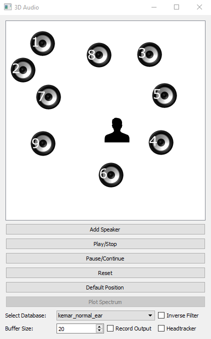

# Python 3D Binaural Audio Simulation
<p align="center">

</p>

### Content
The program provides a Python package to generate 3D Binaural sound for a number of loaded audio sources that can be moved with a GUI in real-time through a virtual 2 dimensional room. The sources can be for example instruments of a band that are mixed together to one 3D audio output that is played at mixing via headphone and saved for later usage as WAVE file recording. The platform independent port-audio library is used for audio playback and a Kemar HRTF database (Gardner, Martin, 1994) is used for the filtering process.

### Architecture
The Gui Main Window Class provides the graphical user interface (GUI) which uses the platform-independent Pyside bindings for Qt. The digital signal processing (DSP) algorithm can be stopped and paused through a GUI Main Window instance by using a state object shared with the DSP instance, which is controlled through mutex access. The DSP class holds variables and methods which produce the binaural output. It holds one instance of the DspIn and DspOut class. 

The DSPIn instance allows to read in all speaker wave files and HRTF databases. It applies a Hanning window to Speakerinput and provides a method to convolve the HRTF database response with the speaker input in Frequency domain using Fast Fourier Transformation. The DSPOut instance performs an overlap-add algorithm and mixes all binaural speaker output arrays to one final binaural output block. It holds the PortAudio methods, which are called through a Callback Thread. It also enables the interaction between DSP Thread and PortAudio Thread.

The steps of the DSP loop are:
1. Lock variables which are accessible through state class by gui and dsp algorithm
2. Set the common begin and end sample position in the speaker wave files input which needs to be read in this iteration.
3. Iterate over all speakers
4. Read in current fitting HRTF for left and right ear and speaker block input
5. Convolve HRTFs with speaker block input using fft and overlap add
6. Mix binaural stereo blockoutput of every speaker to one binaural stereo block output having regard to speaker distances.
7. Add mixed binaural stereo block to play queue
8. Unlock shared variables.
9. Read play queue by PortAudio playback thread
10. If selected in GUI MainWindow: record the binaural output to a wave file
11. Finish DSP Algorithm, reset play and pause button

The run() method of the DSP instance is called at program start by GUI Main Window instance as Thread. It generates block by block a binaural audio output and sends it, after the set buffer size is reached, on a second thread to a playback queue which is then read by a PortAudio Callback Thread. To reach a higher computation performance the initialization function of the DspIn and DspOut instance performs time intensive calculations before starting the run() method. 

### Installation
You can install the package audio3d as following:

```python
conda create -n py34 python=3.4 -c conda-forge
activate py34
cd audio3d/src
python setup.py install
python audio3d
```

A documentation of all classes can be found in "sphinx_documentation/_build/html/index.html". Unit tests are given in "src/audio3d/".

### Authors
Felix Pfreundtner, Huaijiang Zhu, Manuela Heiss, Matthias Lederle
